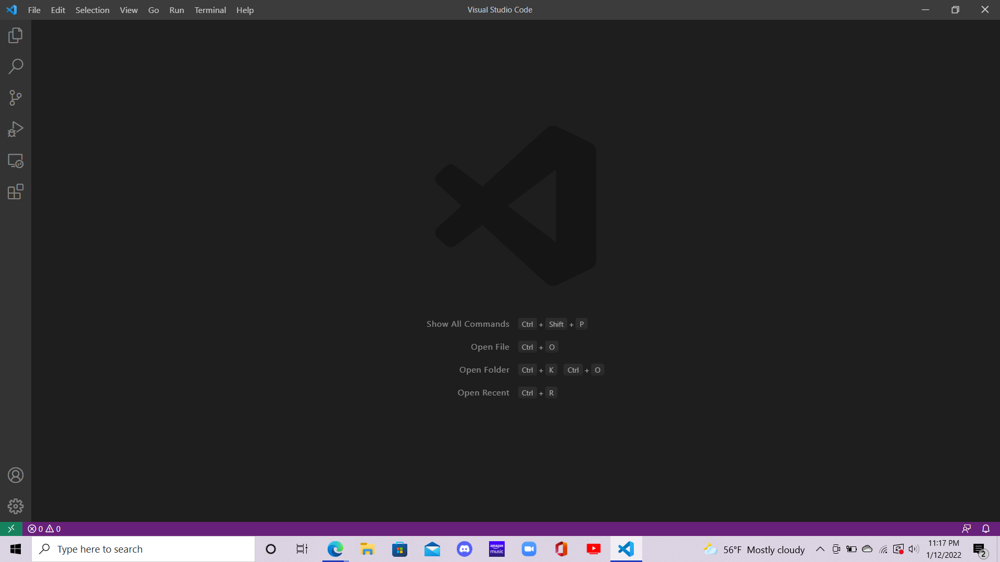
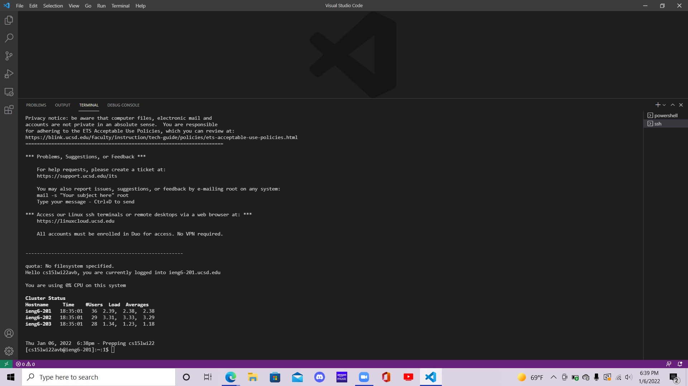
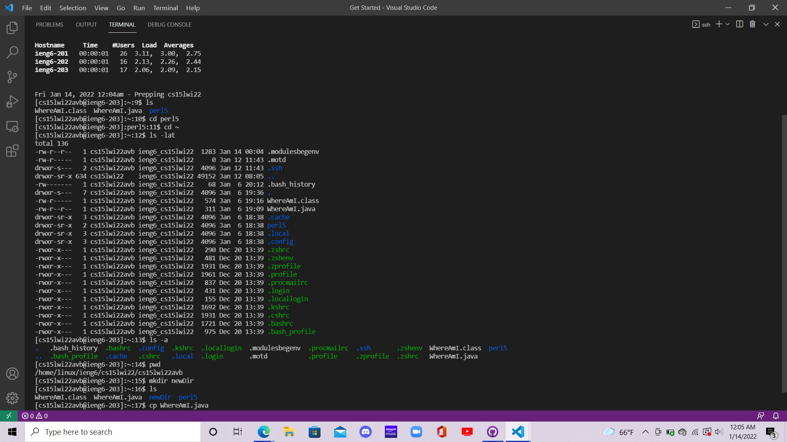
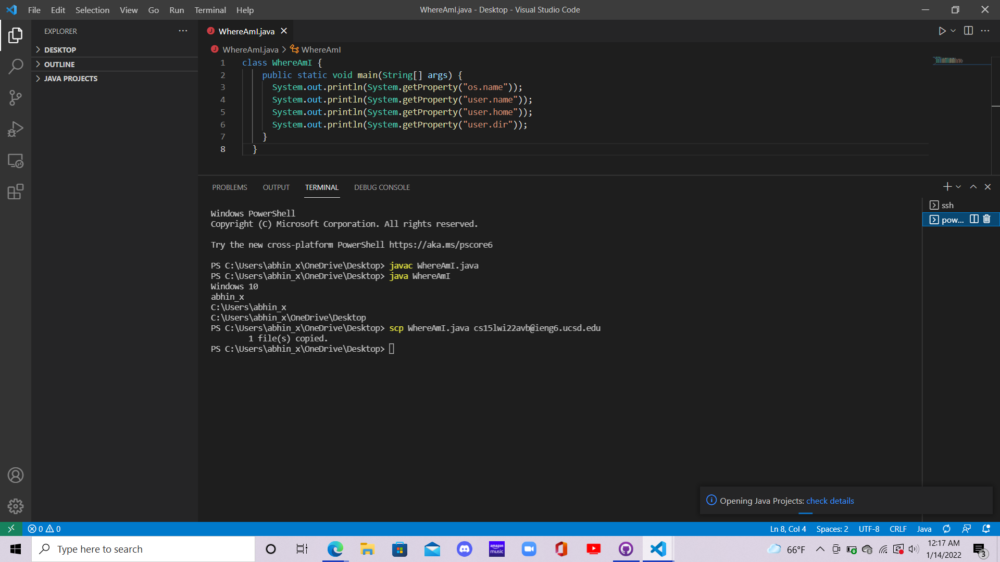
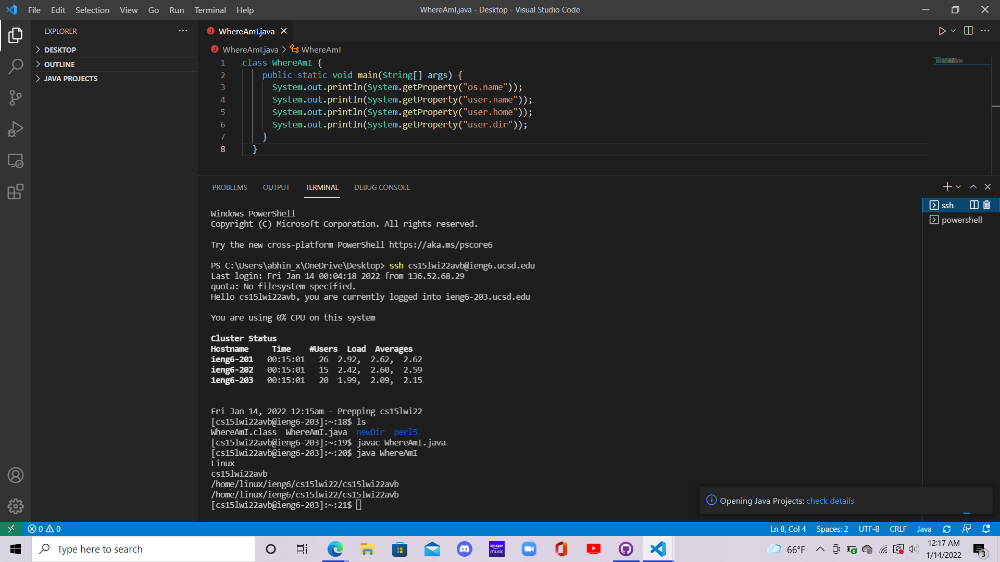
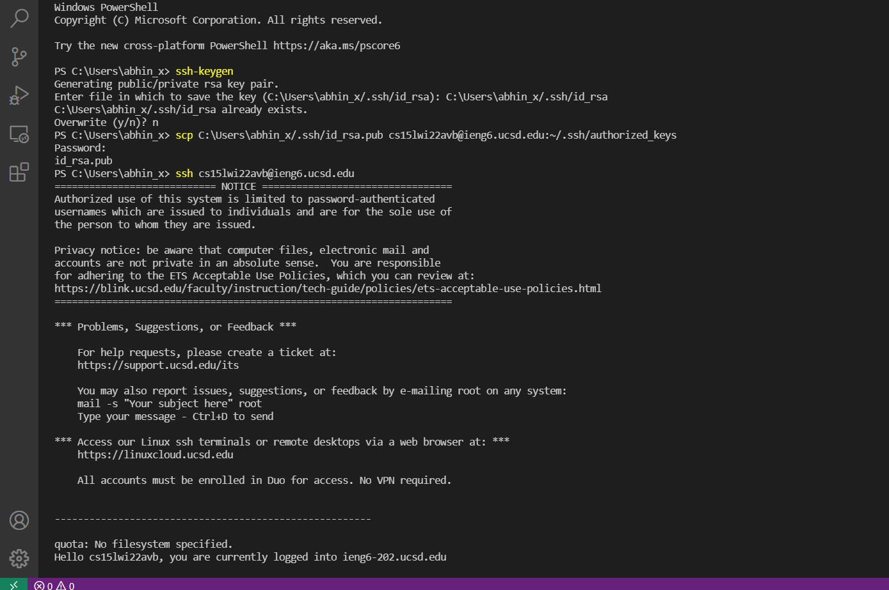
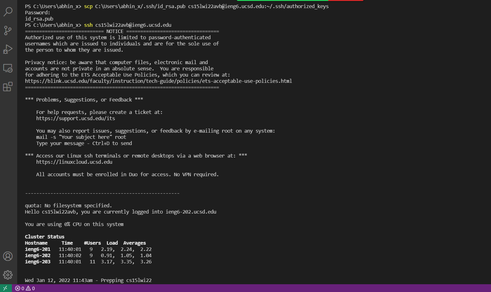
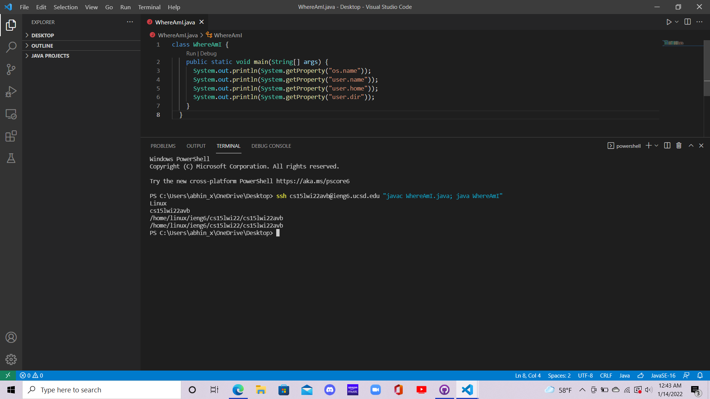

# Lab Report 1 Week 2

## VS Code Installation

* The first step to install VS Code is to go to [this link](https://code.visualstudio.com/) and choose which OS to download VS Code onto, and then click the download button.
* After it downloads onto your computer, I followed the prompts to setup VS Code.
* Finally, it should look like the image above

## Remotely Connecting

* Since I was using Windows, I first had to install OpenSSH. To do so, I went to Settings, and then Apps under that and clicked on Optional Features. OpenSSH Client was already downloaded, but I had to use the "Add a feature" option to add OpenSSH server
* Next, I opened a terminal in VS Code and typed the command: ssh cs15lwi22avb@ieng6.ucsd.edu, which prompted me to enter my password. 
* After doing so (while keeping in mind java does not show your password on screen while you type it), I was remotely connected to my ieng6 account, and my terminal looked as it does above

## Run Some Commands

* I explored several commands like cd (change directory), ls (lists files in current directory), pwd (prints working directory), mkdir (makes new directory), and cp (copies file). The results of these commands can be seen in the picture above.
* However, I did notice some commands like ls -a (lists all files in directory, including hidden ones) and cd ~ (changes directory to parent directory) did not work on my Windows terminal. I realized that this is because Windows uses powershell unlike the Linux systems I was remotely connected to, and powershell does not recognize these commands. However, the basic commands like cd, ls, pwd, mkdir, and cp all remained the same on powershell.

## Moving Files with scp

* The scp command allows files to be moved from the local client to the remote server. 
* I wanted to move the file WhereAmI.java to my ieng6 account, so I used the command scp WhereAmI.java cs15lwi22avb@ieng6.ucsd.edu and this copied the file to my ieng6 account.
* When WhereAmI.java is run, it prints info about the computer it is being run on, so there was a difference in what was printed when I ran it on my local computer versus when I ran on the one I was remotely connected to, as can be seen in the pictures above.

## Setting an SSH Key

* An SSH key allows me to ssh into my ieng6 account and move files to my ieng6 account from my local computer without having to enter my password each time.
* The first step was to type the command ssh-keygen into my terminal, and this generated a public and a private key. 
* Using scp, I made a copy of the public key in a hidden file called .ssh in my ieng6 home directory, allowing me to use ssh and scp without having to retype my password everytime.

## Optmizing Remote Running

* After typing the command to ssh into my ieng6 account, I added "javac WhereAmI.java; java WhereAmI" before hitting enter.
* This utilized 2 methods of optimizing remote running, since placing a command in quotes after the ssh command immediately runs that command and exits the remote connection and using semicolons between multiple commands allows multiple commands to be run on the same line.
* As seen in the picture, this allowed me to remotely connect to my ieng6 account, compile WhereAmI.java (which was already moved to the ieng6 account with scp earlier), run WhereAmI.java, and exit the remote connection all in one line.
