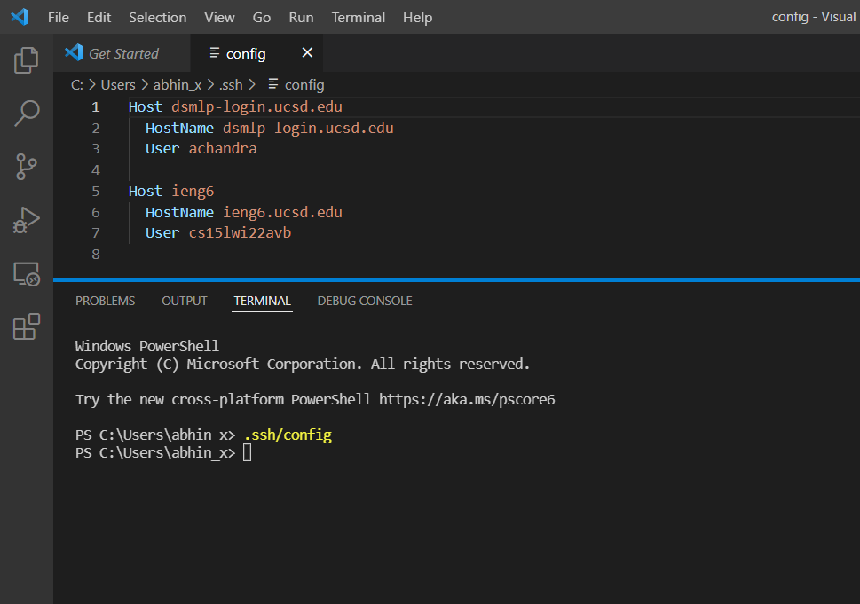
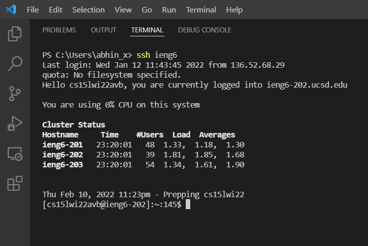

# Lap Report 3 Week 6

## Editing the `.ssh/config` file

I was able to edit this simply by typing `.ssh/config` into a terminal in VS Code, and this gave me the option to open the file in VS Code where I was able to add the necessary information about Host, Hostname, and User. The image below demonstrates this.

## Demonstrating the new `ssh` command

Following the updates to the `.ssh/config` file, I was able to connect to my ieng6 simply by typing `ssh ieng6` into my terminal. The image below demonstrates this.

## Demonstrating `scp` command with new alias 

The new alias can be used to shorten `scp` commands. I was able to move a file called `RandomFile.java` to my remote account with the command `scp RandomFile.java ieng6`, and this can be seen in the picture below. The first time, when `ls` is called after making the remote connection, `RandomFile.java` does not show up. After that, I exited the remote connection and called the `scp` command mentioned above. Then I connected back to my ieng6 account and called `ls` again, and `RandomFile.java` showed up this time, showing that the new, shorter `scp` command worked.
