# Lab Report 4 Week 8

[This is a link to my own markdown-parse repository](https://github.com/Abhinav24831/markdown-parse)

[This is the link to the markdown-parse repository I reviewed](https://github.com/zhl010/markdown-parse)

## Snippet 1
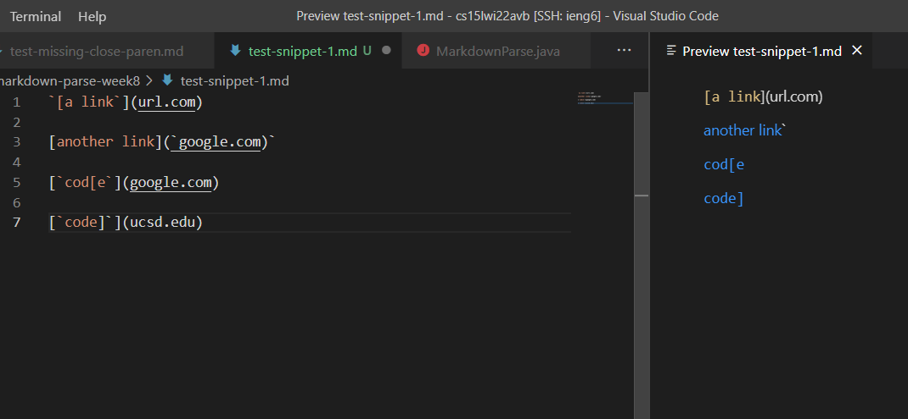

* According to what shows up as links in the image above, the expected result is ``[`google.com, google.com, ucsd.edu]``.
* The image below show how it was turned into a test. Note that, as seen in the image above, snippet one was saved in `test-snippet-1.md`.

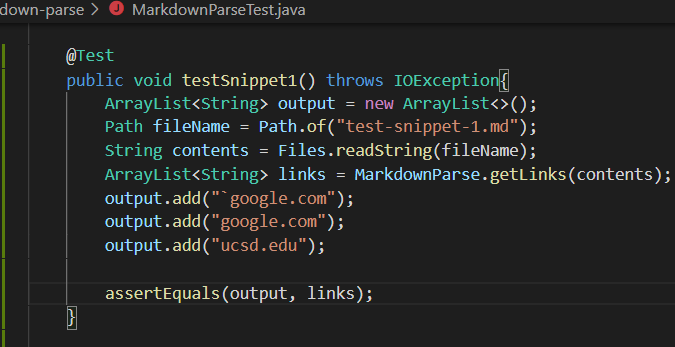

* On my implementation, the test did not pass, and the JUnit output for this can be seen in the image below.

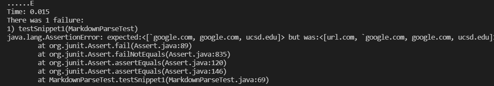

* On the implementation I reviewed, the test did not pass, and the JUnit output for this can be seen in the image below.

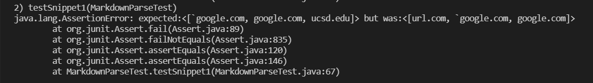

* For cases that use inline backticks, it is possible that a small code change could be help solve the issue. The code can search for backticks and ensure links are not added if there is a pair of backticks such that one is outside the square brackets of the link and the other is inside the square brackets. This could ensure that when inline backticks are present, the code does not record text that is actually not a link.

## Snippet 2

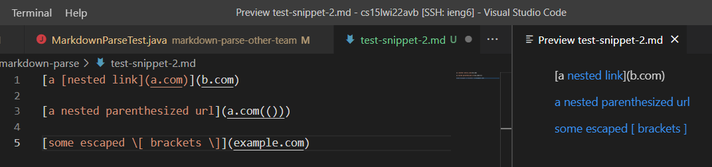

* According to what shows up as links in the image above, the expected result is `[a.com, a.com(()), example.com]`.
* The image below show how it was turned into a test. Note that, as seen in the image above, snippet one was saved in `test-snippet-2.md`.

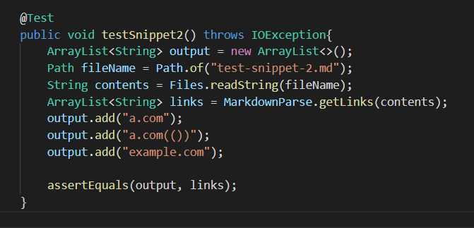

* On my implementation, the test did not pass, and the JUnit output for this can be seen in the image below.

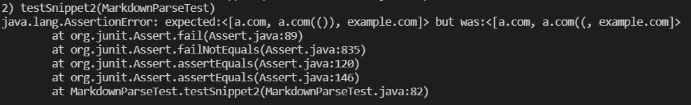

* On the implementation I reviewed, the test did not pass, and the JUnit output for this can be seen in the image below.

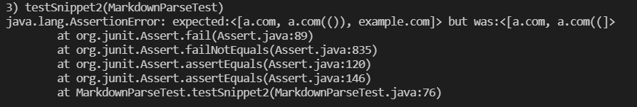

* For cases with nested parentheses, brackets, and escaped brackets, I do not think a small change is the solution. I do not think these changes could be solved in less than 10 lines since the similarity to the parentheses and brackets that the code already looks for is too great, so I think this may require extra helper functions. These would likely be more than 10 lines, as lengthier code may be necessary to explicitly differentiate between a nested or escaped parentheses and brackets and other parentheses and brackets.

## Snippet 3

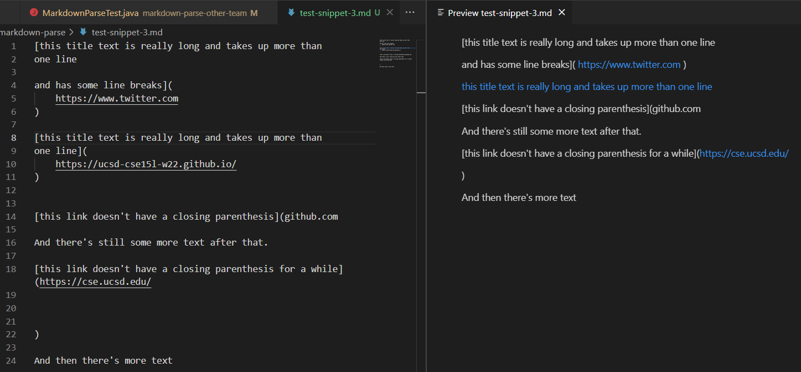

* According to what shows up as links in the image above, the expected result is `[https://www.twitter.com, https://ucsd-cse15l-w22.github.io/, https://cse.ucsd.edu/]`.
* The image below show how it was turned into a test. Note that, as seen in the image above, snippet one was saved in `test-snippet-3.md`.

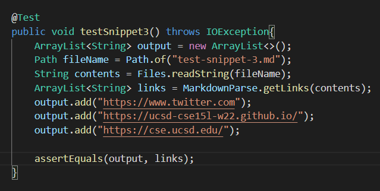

* On my implementation, the test did not pass, and the JUnit output for this can be seen in the image below.

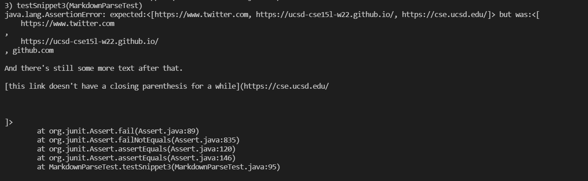

* On the implementation I reviewed, the test did not pass, and the JUnit output for this can be seen in the image below.

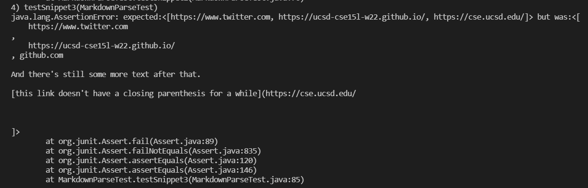

* One small, single-line addition to the code is to the use the String.trim() method to remove white space. However, that does not solve the problem of extra text being added, and similar to the problem with nested or escaped parentheses and brackets, it appears as if extra helper functions would be needed to ensure the extra text is not added. This would likely go beyond 10 lines. 