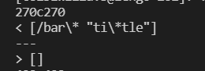
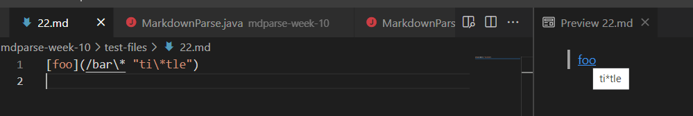
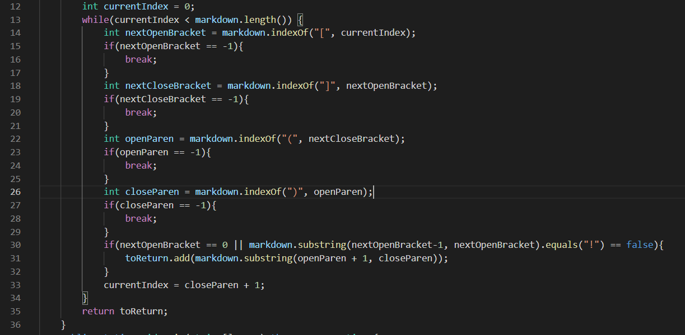
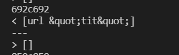
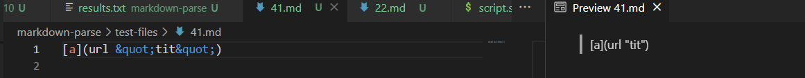

# Lab Report 5 Week 10

This lab report contains the differences between my own markdown parse code and the given markdown parse code. I used the `diff` command to identify the differences. 

After seeing the initial results, I was a little confused about which result corresponded to which text, so I edited the `script.sh` file and added the line `echo "$file"`in the for loop to print out which test file each result corresponded to. 

## Test File 22

* The result of using the `diff` command is below. From this, it can be discerned that the result of my markdown parse code was `[/bar\* "ti\*tle"]`, while the result of the given markdown parse code was `[]`:

* The expected result from the VS Code preview is supposed to be `[ti*tile]`, as seen below, so this means that neither implementation is correct:

* Looking at the code below from my own implementation of the markdown parser, I think that the primary problem lies within this while loop. It appears that with the precense of quotes within the parentheses portion of a link in markdown, only the part within quotes counts as the link. Furthermore, slashes are also not counted as part of the link. However, in my code, the while loop from lines 14-33 does not check for any special characters other than brackets and parentheses, so it simply took all the text within brackets.

## Test File 41

* The result of using the diff command is below. From this, it can be seen that the result of my markdown parse code was `[url &quot;tit&quot;]` and the result of the given markdown parse code was `[]`.

* As seen in the image below, the expected result from the VS Code preview is supposed to be `[]`, so while the result of the given markdown parse code was correct, my own implementation was wrong:

* I think the bug here is similar to the bug from test file 22. The code inside the while loop only checks for brackets and parentheses, and if they are in the correct order, it retreives all the text between the parentheses, regardless of whether or not it is an actual link. Thus, adding some check in the while loop for whether or not the thing being retrieved by the code is actually a link or not could help. This change would again be instituted somewhere between lines 14-33, as seen below

