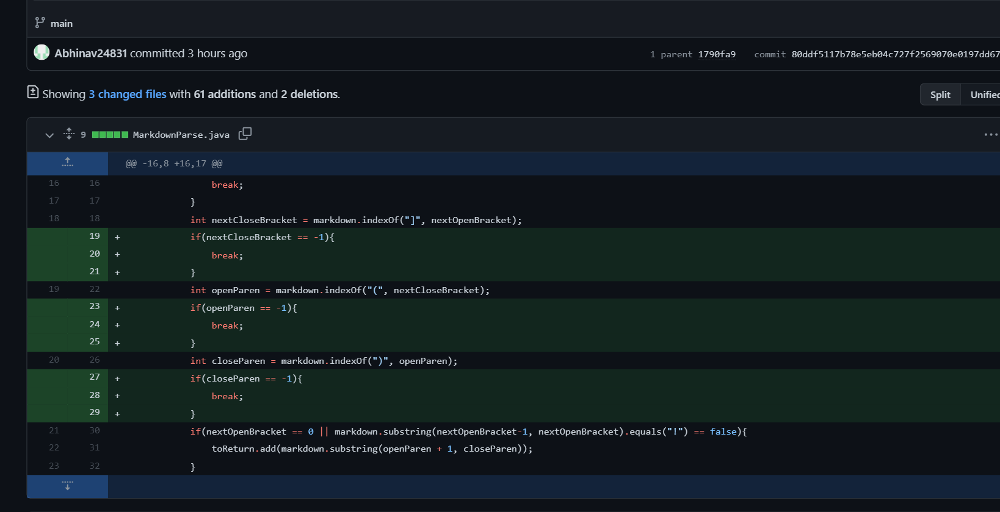

# Week 4 Lab Report

## Fixing the bug when there are no links in the test file

* [Click here](https://github.com/Abhinav24831/markdown-parse/blob/main/test-file5.md) for the test file with failure-inducing input
* The resultant symptom was the following error message:

`Exception in thread "main" java.lang.StringIndexOutOfBoundsException: begin 0, end -1, length 18
        at java.base/java.lang.String.checkBoundsBeginEnd(String.java:3751)
        at java.base/java.lang.String.substring(String.java:1907)
        at MarkdownParseUnedited.getLinks(MarkdownParseUnedited.java:19)
        at MarkdownParseUnedited.main(MarkdownParseUnedited.java:28)`
* The failure-inducing input in this case is a markdown file with no links added at all. When this test file is fed as an argument, it produces the symptom of an `IndexOutOfBoundsException`. Considering the symptom and recognizing that `indexOf` returns -1 when the character is not found, it helps recognize the bug, which arose from -1 being passed as an input to the substring method, resulting in the aforementioned exception.

## Fixing bug that adds image links to output

* [Click here](https://github.com/Abhinav24831/markdown-parse/blob/main/test-file2.md) for the test file with the failure-inducing input
* This produced the following symptom

`[https://something.com, https://something123.com]`
* The failure-inducing input is a markdown file with an image, and it is important to recognize that in markdown, the structure of an image is the same as a link, but with an exclamation mark at the front. Passing this test file as an argument resulted in the symptom of the image link being added to the ArrayList output. This led to the discovery of the bug in the code that led to an inability to differentiate between image links and regular links since the logic the code uses to identify regular links works correctly for image links too

## Fixes bug that causes infinite while loop

* [Click here](https://github.com/Abhinav24831/markdown-parse/blob/main/test-file3.md) for the test file with the failure-inducing input
* This produced the symptom of a never ending while loop
* The failure-inducing input is a test file with parantheses and brackets as regular text rather than part of a link. The resultant symptom is an infinite while loop. This led to the discovery of the bug that causes the `currentIndex` to not update if parantheses and brackets are used in the text in an order that is different from the structure of a link, leading to a never ending while loop.